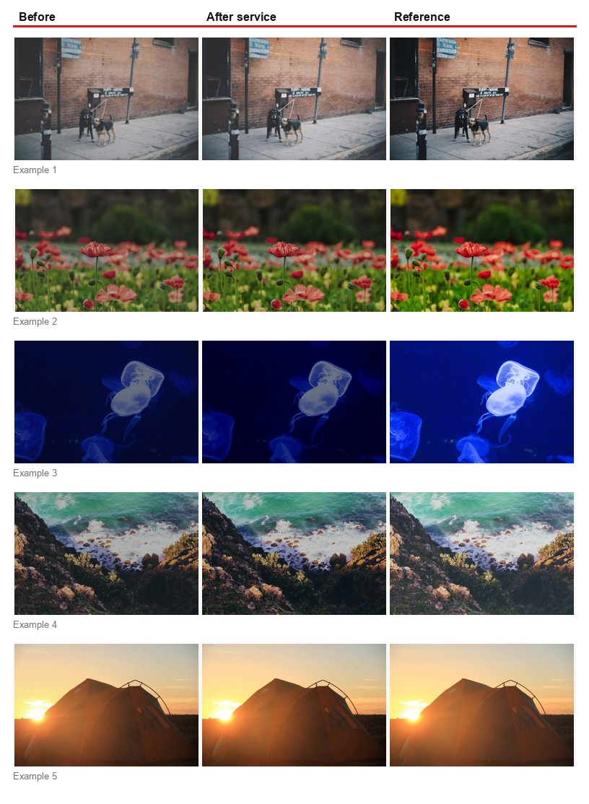

# Улучшение изображений в браузере

Проект разработан в рамках задания VK Education. Цель работы — создать веб-систему, которая улучшает качество изображений в реальном времени за счет запуска ML-модели прямо в браузере пользователя.

Веб-система для улучшения качества изображений прямо в браузере пользователя. Проект реализует клиентский ML-модуль: модель локально подбирает параметры коррекции качества изображения, а вспомогательный алгоритм применяет коррекцию яркости, контрастности, цветности и gamma в `Web Worker`.

Изображение не отправляется на сервер. Обработка выполняется асинхронно, с отображением статуса, прогресса и времени выполнения.

## Что сделано

- Реализован пользовательский интерфейс для загрузки, обработки, сравнения и скачивания изображения.
- Реализован публичный API модуля для постановки задачи, проверки статуса, отмены задачи и получения результата.
- Реализованы события изменения статуса и прогресса через `statuschange`.
- Обработка вынесена в `Web Worker`, поэтому основной поток браузера не блокируется.
- Добавлена проверка размера входного изображения: максимум 15 мегапикселей.
- Поддержаны форматы JPG, PNG, BMP, HEIC/HEIF.
- Обучена компактная ML-модель, которая работает в браузере без тяжелых ML-библиотек.
- Добавлен notebook для обучения, валидации и просмотра примеров результата.
- Подготовлен workflow для деплоя на GitHub Pages.

## Данные

Для обучения и проверки использован датасет:

[Image Super Resolution (from Unsplash) на Kaggle](https://www.kaggle.com/datasets/quadeer15sh/image-super-resolution-from-unsplash?resource=download&select=Image+Super+Resolution+-+Unsplash)

По описанию Kaggle, датасет собран на основе изображений Unsplash и подготовлен для задачи image super-resolution. В нём есть high-resolution изображения и low-resolution версии, созданные на нескольких уровнях уменьшения качества. Лицензия датасета указана как **CC0: Public Domain**.

Так как в задании требуется не super-resolution, а улучшение изображения по параметрам яркости, контрастности и цветности, датасет был использован следующим образом:

1. Папка `high res` использовалась как набор эталонных качественных изображений.
2. Скрипт `ml/create_synthetic_pairs.py` создавал из них пары `low/high`, где `low` — искусственно ухудшенная версия изображения, а `high` — эталон.
3. Ухудшения включали изменение яркости, контрастности, цветности, gamma, легкий blur/noise и JPEG-сжатие.
4. На этих парах обучалась модель выбора параметров коррекции.

Текущая конфигурация обучения:

- всего пар: `2400`;
- train: `1920`;
- validation: `480`;
- разделение: `80/20`;
- hidden units: `24`;
- эпохи: `4000`;
- метрики сохраняются в `ml/training_metrics.json`;
- веса браузерной модели экспортируются в `src/modelWeights.js`.

## Пример работы сервиса

Ниже показаны 5 примеров обработки из validation-набора: слева входное изображение, в центре результат работы сервиса, справа эталонное изображение.



## Соответствие требованиям

| Требование | Реализация в проекте |
| --- | --- |
| ML-модель запускается в браузере пользователя | Да. Веса модели находятся в `src/modelWeights.js`, inference выполняется в `src/enhance.worker.js`. |
| Улучшение по яркости, контрастности и цветности | Да. Модель предсказывает параметры яркости, контраста, насыщенности и gamma, затем worker применяет коррекцию к пикселям. |
| Работоспособность в современных браузерах | Используются стандартные браузерные API: `Web Worker`, `Canvas`, `createImageBitmap`, `Blob`, `EventTarget`. |
| Код до 10 MB | Да. Production build значительно меньше 10 MB. |
| Обработка изображений до 15 Мп | Да. В worker есть проверка `MAX_PIXELS = 15_000_000`. |
| Максимальное время обработки до 30 секунд | Архитектура рассчитана на это ограничение, обработка идет чанками в worker. В интерфейсе показывается время выполнения. |
| Среднее время обработки около 5 секунд | Зависит от размера изображения и устройства. Для отчета можно проверять по отображаемому времени в интерфейсе. |
| JPG, PNG, HEIC, BMP | Да. JPG/PNG/BMP декодируются браузером, HEIC/HEIF обрабатывается через `heic2any`. |
| Асинхронная работа без блокировки браузера | Да. Основная обработка выполняется в `Web Worker`, прогресс отправляется событиями. |
| Получение изображения через API | Да. Метод `enqueueTask(file)`. |
| Получение статуса задачи | Да. Метод `getStatus(taskId)`. |
| Прерывание задачи | Да. Метод `cancelTask(taskId)`. |
| Получение готового изображения | Да. Метод `getResult(taskId)`. |
| Событие изменения статуса | Да. Событие `statuschange` содержит id задачи, статус и прогресс. |
| Выгрузка готового изображения | Да. Результат возвращается как PNG `Blob`, в UI доступна кнопка скачивания. |
| Публичный хостинг | Хостинг сделан с помощью github pages [по данной ссылке](https://akimoshka.github.io/ML_Image_Enhancement/) |

## Как запустить

Установить зависимости:

```bash
npm install
```

Запустить локальную версию:

```bash
npm.cmd run dev -- --host 127.0.0.1
```

Собрать production-версию:

```bash
npm.cmd run build
```

Посмотреть production-сборку локально:

```bash
npm.cmd run preview
```

## API модуля

```js
import { ImageEnhancementAPI } from './src/imageApi.js';

const enhancer = new ImageEnhancementAPI();

const taskId = await enhancer.enqueueTask(file);
const status = enhancer.getStatus(taskId);
const resultBlob = enhancer.getResult(taskId);
const cancelResult = enhancer.cancelTask(taskId);

enhancer.addEventListener('statuschange', (event) => {
  console.log(event.detail.id, event.detail.status, event.detail.progress);
});
```

## Порядок работы системы

1. Пользователь выбирает изображение в интерфейсе.
2. API создает задачу и возвращает `taskId`.
3. Если файл HEIC/HEIF, он предварительно конвертируется.
4. Worker декодирует изображение.
5. Worker проверяет ограничение 15 Мп.
6. Worker извлекает статистики изображения.
7. ML-модель подбирает параметры коррекции.
8. Worker применяет коррекцию по частям, отправляя прогресс.
9. UI получает результат и показывает сравнение до/после.
10. Пользователь скачивает готовое изображение.

## Обучение модели

Notebook для обучения и проверки:

```text
ml/training_and_validation.ipynb
```

Сгенерировать обучающие пары:

```bash
python ml/create_synthetic_pairs.py --source "ml/data/high res" --out ml/data/quality_pairs --variants 3 --limit 800 --max-side 512
```

Обучить модель и экспортировать веса:

```bash
python ml/train_parameter_model.py --dataset ml/data/quality_pairs --out src/modelWeights.js --max-pairs 2400 --validation-split 0.2 --metrics-out ml/training_metrics.json --epochs 4000 --hidden 24
```

В notebook показаны:

- подготовка данных;
- разделение на train/validation;
- график ошибки обучения;
- метрики на validation;
- визуальные примеры `low input -> model output -> high target`.

## Архитектура

```text
UI
  -> ImageEnhancementAPI
    -> HEIC conversion, if needed
    -> Web Worker
      -> image decoding
      -> feature extraction
      -> ML parameter prediction
      -> chunked pixel correction
      -> PNG Blob result
```

Ключевые файлы:

- `src/imageApi.js` — публичный API модуля;
- `src/enhance.worker.js` — обработка изображения и запуск модели;
- `src/modelWeights.js` — экспортированные веса ML-модели;
- `ml/train_parameter_model.py` — обучение модели;
- `ml/create_synthetic_pairs.py` — подготовка обучающих пар;
- `ml/training_and_validation.ipynb` — обучение, валидация и визуальная проверка;
- `docs/example_results.jpg` — примеры работы сервиса.

## Хостинг

Проект подготовлен для GitHub Pages. Workflow находится в:

```text
.github/workflows/deploy.yml
```

Workflow собирает проект и публикует содержимое `dist` в ветку `gh-pages`.

## Ограничения

Модель намеренно сделана маленькой, потому что проект должен работать в браузере и укладываться в общий лимит кода 10 MB. Она улучшает тон, яркость, контрастность и цветность изображения, но не является super-resolution моделью и не восстанавливает полностью потерянные детали у сильно пикселизированных изображений.
